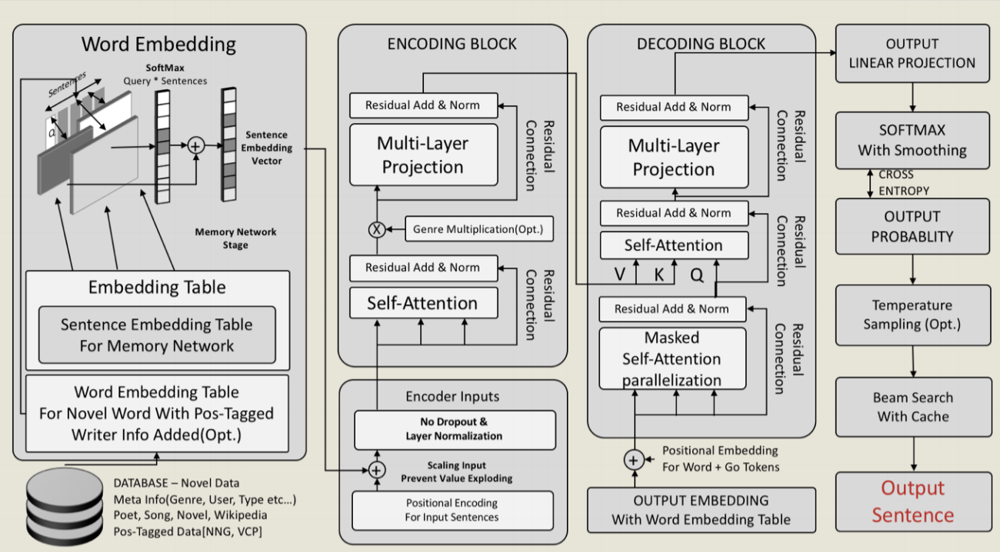
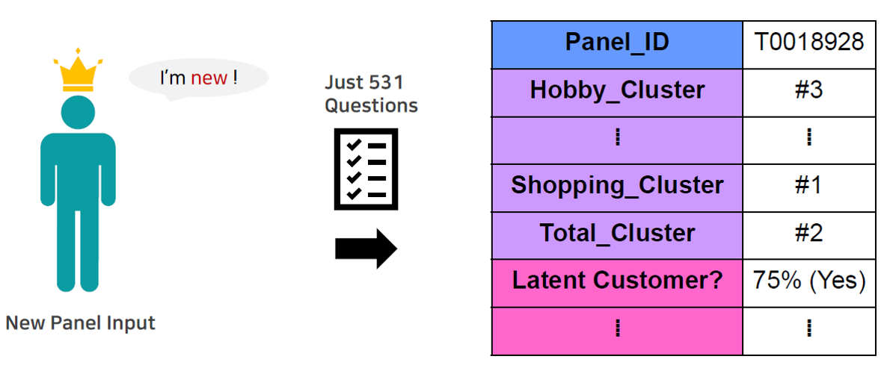
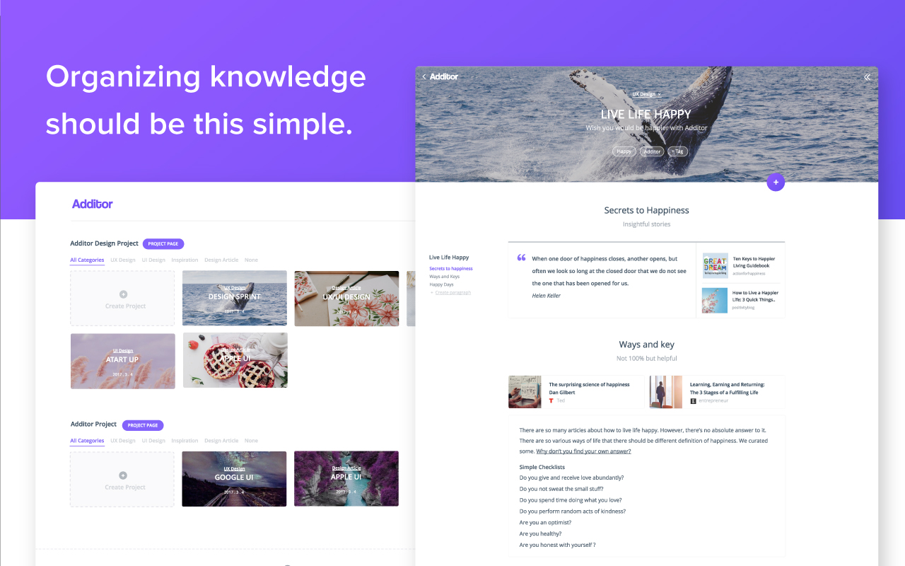
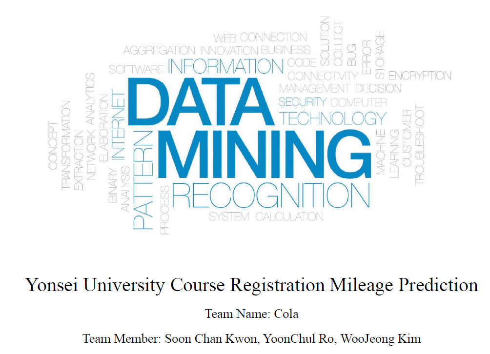

<title>Woojeong Kim</title>
<h1> Woojeong Kim  김우정</h1>

 Hello! I am currently a research intern at Korea Institute of Science and Technology (KIST). I am a member of <a href="https://kdst.tistory.com/">KIST Data Science Team</a>. My research interests lie in the broad field of machine learning and natural language processing. Before joining KIST, I received a B.A. in Applied Statistics and a B.S. in Computer Science from Yonsei University.

[ CV](CV_Woojeong_Kim.pdf)&nbsp;&nbsp;
[ GitHub](https://github.com/friendshipkim)&nbsp;&nbsp;
[ Email](mailto: woojeongkim@kist.re.kr)
 

---
## Research Interest
&nbsp;&nbsp;&nbsp;&nbsp;**Natural Language Generation** 
&nbsp;&nbsp;&nbsp;&nbsp;**·**&nbsp;&nbsp;Generating diverse and context-coherent output 
&nbsp;&nbsp;&nbsp;&nbsp;**·**&nbsp;&nbsp;dialogue agent with persona 

&nbsp;&nbsp;&nbsp;&nbsp;**Word Embeddings** 
&nbsp;&nbsp;&nbsp;&nbsp;**·**&nbsp;&nbsp;Interpretable & Explainable Word embeddings 

&nbsp;&nbsp;&nbsp;&nbsp;**Efficient Neural Network** 
&nbsp;&nbsp;&nbsp;&nbsp;**·**&nbsp;&nbsp;Neural Network Pruning, Knowledge Distillation 

&nbsp;&nbsp;&nbsp;&nbsp;**Neuromorphic Learning Models** 
&nbsp;&nbsp;&nbsp;&nbsp;**·**&nbsp;&nbsp;Spiking Neural Networks, Hierarchical Temporal Memory 

---
## Projects (Now Moving)

<a href="">**Deep Learning Writing Fiction (2018)**</a>  
**·** Collaborated with the startup "Poza Labs"  
**·** The project was presented at PyCon Korea 2018.

---

<a href="">**Customer Survey Result Analysis (2018)**</a>  
**·** Collaborated with the startup "Poza Labs"  
**·** The project was presented at PyCon Korea 2018.

---

<a href="">**Keyword Recommendation System (2018)**</a>  
**·** Collaborated with the startup "Poza Labs"  
**·** The project was presented at PyCon Korea 2018.

---

<a href="">**Course Enrollment Prediction (2018)**</a>  
**·** Collaborated with the startup "Poza Labs"  
**·** The project was presented at PyCon Korea 2018.

---

## Publications

1. *REPrune: Filter Pruning via Representative Election*, Second Author, Under Review

---
## About Me

I love traveling and watching all kinds of sport games (especially baseball and volleyball!)
